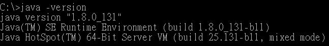
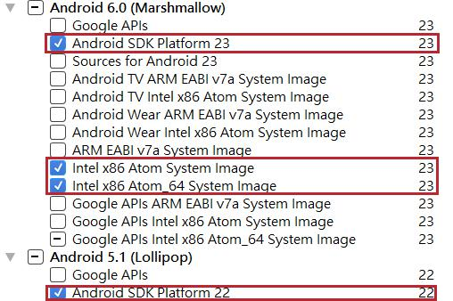
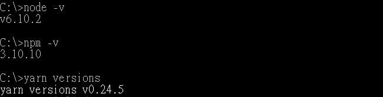

React-Native 環境設定
===


## 前情提要
> 工欲善其事，必先利其器。開始 ***React-Native*** 前，先來了解基本配備吧！

## Java Development Kit (JDK) 
>若只要執行Java的程式，安裝 *JRE (Java Runtime Environment)* 就行了。  
安裝 *JDK* 才可以進行 *Java* 開發，也能夠執行 *Java* 程式哦。  
  
從 Java 官方網站下載並安裝後，還需要設定環境變數，以 **Windows** 來說：  
進入控制台 > 系統 > 進階系統設定 > 環境變數  
在使用者變數新增以下設定  

- JAVA_HOME : `C:\Program Files\Java\jdk1.8.0_131` <-- 安裝位置
- JDK_HOME : `%JAVA_HOME%`
- JRE_HOME : `%JAVA_HOME%\jre`
- CLASSPATH : `%JAVA_HOME%\lib;%JAVA_HOME%\jre\lib`
- PATH      : `%JAVA_HOME%\bin`

開啟 cmd 輸入 `java -version` 出現版本號就成功囉～  

 

## Android Studio
>這是個 *Android IDE*，在此安裝是為了更方便的管理 *Android SDK (Software Development Kit)*，也就是 *Android* 開發環境。

安裝 Android SDK 途中可以讓精靈自動設定環境變數，若要手動設定，只需新增  
  
- ANDROID_HOME : `your_SDK_install_path`
  
### SDK 與模擬器設定
開啟 Android Studio > Tools > Android > SDK Manager  
點右下角的 *Show Package Details*，將以下打勾後，  
  
  
  
切換到隔壁頁 SDK Tools，把下列也打勾勾 : 
   
+ Android SDK Build-Tools
    + 23.0.1 ✔
+ Android SDK Platform-Tools ✔
+ Android SDK Tools ✔
+ Intel x86 Emulator Accelerator (HAXM installer) ✔
+ Android Support Repository ✔
  
按下 OK 等它跑完吧～  

接下來到 Tools > Android > AVD Manager > Create Virtual Device...  
選擇模擬器樣式、版本，在按 Finish，模擬器就建好咯！

## Node.js, npm, yarn
> *Node.js* 為 *JavaScript* 開發環境，高效能、跨平台、還有集大成的套件管理程式 *npm*。

Node 和 npm 會在安裝時自動設定環境變數，在 cmd 就能直接使用。  
  
在此建議一個套件管理工具 **Yarn**， 是 Facebook 發佈 JavaScript 套件管理工具，與 npm 功能相同，但套件安裝速度更快，還會儲存 Cache ，不同專案間使用同一套件時不必重新下載，官方認證！  
  
安裝方式：  
```
npm install -g yarn
```
  
確認安裝和版本：  
   
 
## Consistent Coding Style with VS Code
>光是瞭解別人的 Code 就是件難事，~~寫的髒兮兮更是地獄~~，合作時若能統一格式，在心理或是生理都是莫大的福音，在職場上更是無往不利。

### ESLint & airbnb
透過設定 `.eslintrc`，以及在 IDE 中安裝 Eslint 擴充套件，就能夠實現統一格式啦 (灑花  
  
以 VS Code 為例子，在擴充功能中搜尋 **ESLint** 就能安裝，  
接下來在專案的根目錄中新增 `.eslintrc` 檔案並輸入：  
```
 // .eslintrc
 
 {
    "env": {
        "browser": true,
        "node": true,
        "es6": true
    },
    "parser": "babel-eslint",
    "extends": [
        "airbnb"
    ],
    "parserOptions": {
        "ecmaFeatures": {
            "experimentalObjectRestSpread": true,
            "jsx": true
        },
        "sourceType": "module"
    },
    "plugins": [
        "react",
        "react-native"
    ],
    "rules": {
        "indent": [
            "error",
            2
        ],
        "quotes": [
            "error",
            "single"
        ],
        "semi": [
            "error",
            "always"
        ],
        "react/jsx-filename-extension": [1, { "extensions": [".js", ".jsx"] }],
        "no-use-before-define": 0
    }
}
```
裡頭的多種格式設定，最主要的就是 [**airbnb**](https://github.com/airbnb/javascript "airbnb Coding Style")，只要格式不符，Code 中都會跑出紅紅的波浪。  
  
最後在 **devDependencies** (只有開發時需要) 安裝幾個 javascript 套件：  

```
> npm install --dev eslint babel-eslint  eslint-config-airbnb eslint-plugin-import eslint-plugin-jsx-a11y eslint-plugin-react eslint-plugin-react-native

// or

> yarn add --dev eslint babel-eslint  eslint-config-airbnb eslint-plugin-import eslint-plugin-jsx-a11y eslint-plugin-react eslint-plugin-react-native
```

還可在 VS Code 的設定中加入：
```
// setting.json

{
  // other settings...,
  "eslint.autoFixOnSave": true, // 儲存時自動修正格式
  "editor.insertSpaces": true, // 鍵入Tab時輸入Spaces
  "editor.tabSize": 2, // Tab的寬度
}
```

### EditorConfig
EditorConfig 能夠直接修正 Code Style，與 ESLint airbnb 相比之下，前者為針對語言和編輯器進行設定，後者專注專案的整體架構(javascript)。  

在 VS Code 安裝擴充功能 `EditorConfig for VS Code`，並在根目錄中新增 `.editorconfig` 。
```
// .editorconfig

root = true

[*]
indent_style = space
indent_size = 2
charset = utf-8
trim_trailing_whitespace = true
insert_final_newline = true
end_of_line = lf
max_line_length = null

```
安裝 EditorConfig 套件之後，IDE 會搜尋 `.editorconfig` 的存在，遇到 `root = true` 才會停止，當然可能會找到多個 `editorconfig`，同一條規則以最靠近專案的設定檔為主。  
  
`[ ]` 是用來篩選檔名，也可以寫成 `[*.js]` 只針對 Javascript 檔案格式化。  

